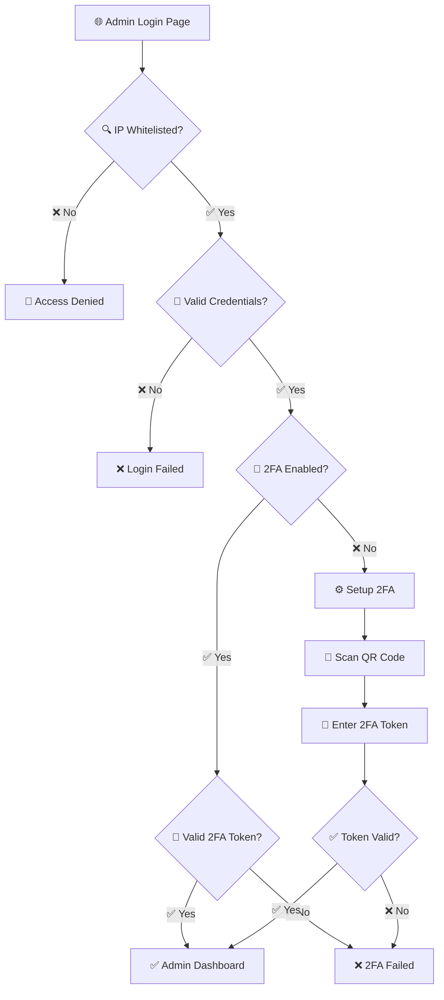

<div align="center">

# 🎯 CVGenius

### AI-Powered CV Builder Platform with Enterprise-Grade Admin Dashboard

[](https://opensource.org/licenses/MIT)
[](https://nextjs.org/)
[](https://www.typescriptlang.org/)
[](https://tailwindcss.com/)
[](https://ai.google.dev/)
[](https://vercel.com)

[](docs/CONTRIBUTING.md)
[](docs/CODE_OF_CONDUCT.md)
[](https://github.com/CemRoot/cv-genius-project-v2/graphs/commit-activity)
[](https://github.com/CemRoot/cv-genius-project-v2/issues)
[](https://github.com/CemRoot/cv-genius-project-v2/stargazers)

**[🚀 Live Demo](https://cvgenius-one.vercel.app)** • **[📚 Documentation](docs/)** • **[👨‍💼 Admin Panel](https://cvgenius-one.vercel.app/admin)** • **[🐛 Report Bug](https://github.com/CemRoot/cv-genius-project-v2/issues)**

---

**🔒 Privacy-First** | **📊 ATS-Optimized** | **🤖 AI-Powered** | **📱 Mobile-First PWA** | **🛡️ Enterprise Security**

*Build professional, ATS-friendly CVs with AI assistance. No registration required, your data stays local.*


</div>

---

## 📋 Table of Contents

- [Overview](#-overview)
- [Key Features](#-key-features)
- [Demo & Screenshots](#-demo--screenshots)
- [Technology Stack](#-technology-stack)
- [Quick Start](#-quick-start)
  - [Prerequisites](#prerequisites)
  - [Installation](#installation)
  - [Environment Setup](#environment-configuration)
  - [Running the App](#running-the-application)
- [Project Structure](#-project-structure)
- [Security](#-security)
- [Deployment](#-deployment)
- [API Documentation](#-api-documentation)
- [Testing](#-testing)
- [Contributing](#-contributing)
- [License](#-license)
- [Support & Contact](#-support--contact)
- [Acknowledgments](#-acknowledgments)

---

## 🎯 Overview

CVGenius is a **production-ready**, **enterprise-grade** CV builder platform that combines cutting-edge AI technology with robust security features. Designed for privacy-conscious users and administrators who demand full control over their data and infrastructure.

### 🌟 Why CVGenius?

<table>
<tr>
<td width="33%" align="center">

**🔒 Privacy-First**

No user accounts, no tracking
All data stored locally
GDPR compliant by design

</td>
<td width="33%" align="center">

**🤖 AI-Powered**

Google Gemini 2.0 Flash
Smart content suggestions
ATS optimization

</td>
<td width="33%" align="center">

**🛡️ Enterprise Security**

Multi-layer authentication
2FA + IP whitelisting
Encrypted audit logs

</td>
</tr>
</table>

### 📊 Project Statistics

- **6+** Professional CV Templates
- **1,500+** Free AI Requests/Day
- **AES-256** Encryption for Admin Logs
- **JWT + 2FA** Authentication
- **100%** Privacy Focused

---

## ✨ Key Features

<table>
<tr>
<td width="50%">

### 👤 **User Features**

#### 📝 Smart CV Builder
- ✅ **6+ Professional Templates** - Industry-specific, ATS-optimized designs
- ✅ **Real-time Preview** - Live editing with instant preview
- ✅ **Drag & Drop** - Reorder sections with ease
- ✅ **Mobile Upload** - Upload and analyze existing CVs
- ✅ **Multi-language Support** - Optimized for global markets

#### 🤖 AI-Powered Tools
- ✅ **Intelligent Suggestions** - Context-aware content recommendations
- ✅ **Cover Letter Generator** - Personalized cover letters
- ✅ **ATS Score Analysis** - Optimize for applicant tracking systems
- ✅ **Industry Recommendations** - Tailored for your field

#### 💾 Export Options
- ✅ **PDF Export** - High-quality, ATS-friendly PDFs
- ✅ **DOCX Export** - Editable Word documents
- ✅ **Plain Text** - Simple text format

#### 📱 Progressive Web App
- ✅ **Offline Support** - Work without internet
- ✅ **Mobile-First** - Optimized for all devices
- ✅ **Fast Loading** - Optimized performance

</td>
<td width="50%">

### 🔐 **Admin Features**

#### 🛡️ Security & Authentication
- ✅ **JWT Authentication** - 2-hour tokens with refresh
- ✅ **Two-Factor Auth** - TOTP (Google Authenticator)
- ✅ **IP Whitelisting** - CIDR support, environment-based
- ✅ **CSRF Protection** - Token-based validation
- ✅ **Rate Limiting** - Prevent brute force attacks
- ✅ **Session Management** - Auto-logout with activity tracking

#### 📊 Management Dashboard
- ✅ **AI Configuration** - Context-specific model settings
- ✅ **Prompt Management** - Dynamic AI prompt templates
- ✅ **Ad Controls** - Comprehensive monetization management
- ✅ **Audit Logs** - AES-256 encrypted event tracking
- ✅ **Analytics** - Real-time usage statistics

#### 🔄 Integrations
- ✅ **Vercel Integration** - Environment synchronization
- ✅ **Automated Backups** - Security data protection
- ✅ **API Management** - RESTful API endpoints

#### 📈 Monitoring
- ✅ **Security Monitoring** - Real-time threat detection
- ✅ **Performance Metrics** - Application analytics
- ✅ **Error Tracking** - Comprehensive logging

</td>
</tr>
</table>

---

## 🎬 Demo & Screenshots

### 🌐 Live Demo
Visit our live demo: **[https://cvgenius-one.vercel.app](https://cvgenius-one.vercel.app)**

### 📸 Application Screenshots

<table>
<tr>
<td width="50%">

**CV Builder Interface**


</td>
<td width="50%">

**Admin Dashboard**


</td>
</tr>
<tr>
<td width="50%">

**Template Selection**


</td>
<td width="50%">

**Cover Letter Generator**


</td>
</tr>
</table>

---

## 🛠 Technology Stack

### **Core Technologies**

<table>
<tr>
<th>Category</th>
<th>Technology</th>
<th>Version</th>
<th>Purpose</th>
</tr>
<tr>
<td rowspan="4"><strong>Frontend Framework</strong></td>
<td></td>
<td>15.4</td>
<td>React framework with App Router</td>
</tr>
<tr>
<td></td>
<td>18.3</td>
<td>UI library</td>
</tr>
<tr>
<td></td>
<td>5.0</td>
<td>Type-safe development</td>
</tr>
<tr>
<td></td>
<td>3.4</td>
<td>Utility-first CSS</td>
</tr>

<tr>
<td rowspan="3"><strong>AI & Processing</strong></td>
<td></td>
<td>2.0 Flash</td>
<td>AI content generation</td>
</tr>
<tr>
<td></td>
<td>4.3</td>
<td>PDF generation</td>
</tr>
<tr>
<td></td>
<td>9.5</td>
<td>Word document export</td>
</tr>

<tr>
<td rowspan="3"><strong>State Management</strong></td>
<td></td>
<td>5.0</td>
<td>Lightweight state management</td>
</tr>
<tr>
<td></td>
<td>7.54</td>
<td>Performant forms</td>
</tr>
<tr>
<td></td>
<td>3.25</td>
<td>Schema validation</td>
</tr>

<tr>
<td rowspan="4"><strong>Security</strong></td>
<td></td>
<td>6.0</td>
<td>JWT token management</td>
</tr>
<tr>
<td></td>
<td>3.0</td>
<td>Password hashing</td>
</tr>
<tr>
<td></td>
<td>2.0</td>
<td>TOTP 2FA</td>
</tr>
<tr>
<td></td>
<td>Built-in</td>
<td>AES-256 encryption</td>
</tr>

<tr>
<td rowspan="2"><strong>UI Components</strong></td>
<td></td>
<td>Latest</td>
<td>Component library</td>
</tr>
<tr>
<td></td>
<td>Latest</td>
<td>Headless UI primitives</td>
</tr>

<tr>
<td rowspan="2"><strong>Testing</strong></td>
<td></td>
<td>13.7</td>
<td>E2E testing</td>
</tr>
<tr>
<td></td>
<td>9.0</td>
<td>Code linting</td>
</tr>

<tr>
<td rowspan="3"><strong>Deployment</strong></td>
<td></td>
<td>Latest</td>
<td>Hosting platform</td>
</tr>
<tr>
<td></td>
<td>1.5</td>
<td>Web analytics</td>
</tr>
<tr>
<td></td>
<td>1.2</td>
<td>Performance monitoring</td>
</tr>
</table>

### **Additional Libraries**

| Package | Version | Purpose |
|---------|---------|---------|
| `framer-motion` | 12.23 | Animations |
| `lucide-react` | 0.460 | Icon library |
| `date-fns` | 4.1 | Date utilities |
| `qrcode` | 1.5 | QR code generation |
| `uuid` | 11.1 | Unique ID generation |
| `lodash` | 4.17 | Utility functions |

---

## 🚀 Quick Start

### Prerequisites

Before you begin, ensure you have the following installed:

- **Node.js** `18.x` or higher (recommended: `20.x`)
  [Download Node.js](https://nodejs.org/)

  ```bash
  node --version  # Should be v18.0.0 or higher
  ```

- **npm** `9.x` or higher (or `yarn`/`pnpm`)

  ```bash
  npm --version  # Should be v9.0.0 or higher
  ```

- **Git** for version control
  [Download Git](https://git-scm.com/)

- **Google Gemini API Key** (Free tier: 1,500 requests/day)
  [Get API Key](https://ai.google.dev/)

### Installation

#### 1️⃣ Clone the Repository

```bash
# Clone via HTTPS
git clone https://github.com/CemRoot/cv-genius-project-v2.git

# Or via SSH
git clone git@github.com:CemRoot/cv-genius-project-v2.git

# Navigate to project directory
cd cv-genius-project-v2
```

#### 2️⃣ Install Dependencies

```bash
# Using npm
npm install

# Or using yarn
yarn install

# Or using pnpm
pnpm install
```

#### 3️⃣ Environment Configuration

Create your environment file:

```bash
cp .env.example .env.local
```

Edit `.env.local` with your configuration:

```env
#═══════════════════════════════════════════════════════════
# AI CONFIGURATION (Required)
#═══════════════════════════════════════════════════════════
GOOGLE_AI_API_KEY=your_gemini_api_key_here

#═══════════════════════════════════════════════════════════
# ADMIN SECURITY (Required for Admin Panel)
#═══════════════════════════════════════════════════════════
ADMIN_USERNAME=admin
ADMIN_PWD_HASH_B64=your_bcrypt_hash_base64
JWT_SECRET=your_256_bit_secret_key
ADMIN_IP_WHITELIST=127.0.0.1,::1,localhost

#═══════════════════════════════════════════════════════════
# SECURITY AUDIT (Required for Admin)
#═══════════════════════════════════════════════════════════
AUDIT_ENCRYPTION_KEY=your_32_character_encryption_key

#═══════════════════════════════════════════════════════════
# VERCEL (Optional - For Deployment)
#═══════════════════════════════════════════════════════════
VERCEL_TOKEN=your_vercel_token
VERCEL_PROJECT_ID=your_project_id
```

#### 4️⃣ Generate Secure Credentials

Use these commands to generate secure credentials:

```bash
# Generate password hash
node -e "
const bcrypt = require('bcryptjs');
const password = 'your-secure-password';
const hash = bcrypt.hashSync(password, 10);
const base64 = Buffer.from(hash).toString('base64');
console.log('ADMIN_PWD_HASH_B64=' + base64);
"

# Generate JWT secret (256-bit)
node -e "console.log('JWT_SECRET=' + require('crypto').randomBytes(32).toString('hex'))"

# Generate encryption key (32 characters)
node -e "console.log('AUDIT_ENCRYPTION_KEY=' + require('crypto').randomBytes(16).toString('hex'))"
```

> 💡 **Tip**: Save these generated values in your `.env.local` file

### Running the Application

#### Development Mode

```bash
# Start development server
npm run dev

# Or with Turbopack (faster)
npm run dev:turbo

# Or on a different port
npm run dev:port
```

Visit:
- **🏠 Application**: http://localhost:3000
- **👨‍💼 Admin Panel**: http://localhost:3000/admin
- **📚 API Docs**: http://localhost:3000/api

#### Production Build

```bash
# Build for production
npm run build

# Start production server
npm start
```

#### Additional Commands

```bash
# Type checking
npm run type-check

# Linting
npm run lint

# Clean cache
npm run clean

# Run E2E tests
npm run test:e2e
```

---

## 📂 Project Structure

```
cv-genius-project-v2/
│
├── 📱 src/
│   ├── app/                           # Next.js App Router
│   │   ├── admin/                     # 🔐 Admin Panel
│   │   │   ├── components/            # Admin UI components
│   │   │   │   ├── AdminDashboard.tsx
│   │   │   │   ├── SecuritySettings.tsx
│   │   │   │   └── ...
│   │   │   └── page.tsx               # Admin dashboard page
│   │   │
│   │   ├── api/                       # 🔌 API Routes
│   │   │   ├── admin/                 # Protected admin APIs
│   │   │   │   ├── auth/              # Authentication
│   │   │   │   │   ├── login/
│   │   │   │   │   ├── logout/
│   │   │   │   │   └── verify/
│   │   │   │   ├── 2fa/               # Two-factor authentication
│   │   │   │   ├── audit/             # Security audit logs
│   │   │   │   ├── settings/          # Configuration management
│   │   │   │   └── vercel/            # Vercel integration
│   │   │   └── ai/                    # AI-powered endpoints
│   │   │       ├── suggestions/
│   │   │       ├── optimize/
│   │   │       └── cover-letter/
│   │   │
│   │   ├── builder/                   # 📝 CV Builder App
│   │   │   ├── components/
│   │   │   └── page.tsx
│   │   │
│   │   ├── cover-letter/              # 💌 Cover Letter Generator
│   │   │   └── page.tsx
│   │   │
│   │   ├── layout.tsx                 # Root layout
│   │   └── page.tsx                   # Landing page
│   │
│   ├── components/                    # 🧩 Reusable Components
│   │   ├── ads/                       # Ad management
│   │   │   ├── DynamicAdManager.tsx
│   │   │   ├── BannerAds.tsx
│   │   │   └── SafeAdWrapper.tsx
│   │   ├── cv/                        # CV-related components
│   │   │   ├── CVPreview.tsx
│   │   │   ├── CVForm.tsx
│   │   │   └── ...
│   │   ├── templates/                 # CV templates
│   │   │   ├── ModernTemplate.tsx
│   │   │   ├── ProfessionalTemplate.tsx
│   │   │   └── ...
│   │   └── ui/                        # shadcn/ui components
│   │       ├── button.tsx
│   │       ├── dialog.tsx
│   │       └── ...
│   │
│   ├── lib/                           # 🔧 Utilities & Configs
│   │   ├── ai/                        # AI service integration
│   │   │   └── gemini.ts
│   │   ├── auth/                      # Authentication utilities
│   │   │   ├── jwt.ts
│   │   │   ├── 2fa.ts
│   │   │   └── middleware.ts
│   │   ├── security/                  # Security middleware
│   │   │   ├── csrf.ts
│   │   │   ├── rate-limit.ts
│   │   │   └── audit.ts
│   │   └── utils/                     # Helper functions
│   │       ├── cn.ts
│   │       └── validators.ts
│   │
│   ├── store/                         # 🗄️ State Management
│   │   ├── cv-store.ts                # CV builder state
│   │   └── admin-store.ts             # Admin panel state
│   │
│   └── types/                         # 📋 TypeScript Definitions
│       ├── cv.types.ts
│       ├── admin.types.ts
│       └── api.types.ts
│
├── 📚 docs/                           # Documentation
│   ├── setup/                         # Setup guides
│   │   ├── GEMINI_SETUP.md
│   │   └── VERCEL_2FA_SETUP.md
│   ├── deployment/                    # Deployment guides
│   │   └── VERCEL_DEPLOYMENT_GUIDE.md
│   ├── security/                      # Security docs
│   ├── features/                      # Feature docs
│   ├── CONTRIBUTING.md                # Contribution guide
│   ├── CODE_OF_CONDUCT.md             # Code of conduct
│   └── SECURITY.md                    # Security policy
│
├── 🔧 scripts/                        # Utility Scripts
│   ├── hash-generator.js              # Password hash generator
│   ├── reset-2fa.js                   # 2FA reset utility
│   ├── debug-hooks.js                 # Debug utilities
│   └── deploy-production.sh           # Deployment script
│
├── 📊 data/                           # Runtime Data (gitignored)
│   ├── admin-settings.json            # Admin configuration
│   ├── admin-ip-whitelist.json        # IP whitelist
│   ├── admin-ad-settings.json         # Ad settings
│   ├── cv-builder-prompts.json        # AI prompts
│   └── .2fa-state.json                # 2FA state
│
├── 🌐 public/                         # Static Assets
│   ├── icons/                         # PWA icons
│   ├── img/                           # Images
│   ├── manifest.json                  # PWA manifest
│   ├── sw.js                          # Service worker
│   └── favicon.ico
│
├── 🧪 cypress/                        # E2E Tests
│   └── e2e/
│       └── skills-category-select.cy.js
│
├── 📄 Configuration Files
├── .env.example                       # Environment template
├── .eslintrc.json                     # ESLint config
├── .gitignore                         # Git ignore rules
├── cypress.config.js                  # Cypress config
├── next.config.js                     # Next.js config
├── package.json                       # Dependencies
├── postcss.config.mjs                 # PostCSS config
├── tailwind.config.ts                 # Tailwind config
├── tsconfig.json                      # TypeScript config
└── vercel.json                        # Vercel config
```

---

## 🔒 Security

CVGenius implements **enterprise-grade security** features to protect both users and administrators.

### 🛡️ Security Features

| Feature | Implementation | Purpose |
|---------|---------------|---------|
| **🔐 JWT Authentication** | 2-hour tokens with refresh capability | Secure session management |
| **🔢 Two-Factor Auth** | TOTP (Google Authenticator compatible) | Additional login protection |
| **🌐 IP Whitelisting** | CIDR support, environment-based | Access control by location |
| **🛡️ CSRF Protection** | Token-based request validation | Prevent cross-site attacks |
| **⏱️ Rate Limiting** | In-memory (upgradeable to Redis) | Prevent brute force attacks |
| **📝 Audit Logging** | AES-256-CBC encrypted logs | Track all security events |
| **🔄 Session Recovery** | Auto-restoration on CSRF errors | Improved user experience |
| **🔒 Password Hashing** | bcrypt with salt rounds | Secure password storage |

### 🔐 Admin Access Flow



### 🔐 Security Best Practices

```bash
# ✅ Production Security Checklist

□ Change default admin credentials
□ Configure production IP whitelist
□ Use strong JWT secret (256-bit minimum)
□ Enable 2FA for all admin accounts
□ Set up monitoring and alerts
□ Configure audit log backup
□ Test security features in staging
□ Rotate credentials every 90 days
□ Review audit logs weekly
□ Keep dependencies updated
```

### 🚨 Security Warnings

> ⚠️ **CRITICAL SECURITY RULES:**
>
> - 🚨 **NEVER** commit `.env.local` or authentication files
> - 🔐 Use **strong, unique** passwords (minimum 16 characters)
> - 🔄 **Rotate** admin credentials regularly (every 90 days)
> - 📍 **Restrict** admin access to known IPs only
> - 👁️ **Monitor** audit logs for suspicious activity
> - 🔒 Keep **dependencies updated** for security patches
> - 💾 **Backup** audit logs and configuration files
> - 🔍 Perform **security audits** quarterly

### 🔐 Data Privacy

- ✅ **No user accounts** - Completely privacy-focused
- ✅ **Local storage only** - Data never leaves the browser
- ✅ **No tracking** - No analytics on user CVs
- ✅ **GDPR compliant** - Privacy by design
- ✅ **No cookies** - Session storage only
- ✅ **No third-party scripts** - Except AI API calls

> 📖 **Detailed Security Documentation**: [docs/SECURITY.md](docs/SECURITY.md)

---

## 🌐 Deployment

### Vercel Deployment (Recommended)

#### Quick Deploy

[](https://vercel.com/new/clone?repository-url=https://github.com/CemRoot/cv-genius-project-v2)

#### Manual Deployment

```bash
# 1. Install Vercel CLI
npm install -g vercel

# 2. Login to Vercel
vercel login

# 3. Deploy to preview
vercel

# 4. Deploy to production
vercel --prod
```

#### Environment Variables Setup

1. Go to **Vercel Dashboard** → Your Project
2. Navigate to **Settings** → **Environment Variables**
3. Add all variables from `.env.example`:

```env
# Copy all variables from .env.example
GOOGLE_AI_API_KEY=...
ADMIN_USERNAME=...
ADMIN_PWD_HASH_B64=...
JWT_SECRET=...
ADMIN_IP_WHITELIST=...
AUDIT_ENCRYPTION_KEY=...
```

4. Click **Save** and **Redeploy**

### 🚀 Production Deployment Checklist

```bash
# Before deploying to production:

✅ All environment variables configured in Vercel
✅ Admin credentials changed from defaults
✅ IP whitelist updated for production IPs
✅ 2FA enabled and tested
✅ Custom domain configured (optional)
✅ Analytics and monitoring enabled
✅ Backup strategy implemented
✅ Security features tested
✅ Error tracking configured
✅ Performance optimization verified
✅ SEO metadata configured
✅ SSL certificate active
```

### Alternative Deployment Options

<details>
<summary><b>🐳 Docker Deployment</b></summary>

```dockerfile
# Dockerfile (create this file)
FROM node:20-alpine

WORKDIR /app

COPY package*.json ./
RUN npm ci --only=production

COPY . .
RUN npm run build

EXPOSE 3000

CMD ["npm", "start"]
```

```bash
# Build and run
docker build -t cvgenius .
docker run -p 3000:3000 --env-file .env.local cvgenius
```

</details>

<details>
<summary><b>☁️ Other Platforms</b></summary>

- **Netlify**: Deploy via Git integration
- **AWS Amplify**: Connect GitHub repository
- **Railway**: One-click deploy
- **Digital Ocean App Platform**: Docker container deploy

</details>

> 📖 **Deployment Guide**: [docs/deployment/VERCEL_DEPLOYMENT_GUIDE.md](docs/deployment/VERCEL_DEPLOYMENT_GUIDE.md)

---

## 📡 API Documentation

### Public Endpoints

| Endpoint | Method | Description | Rate Limit |
|----------|--------|-------------|------------|
| `/api/ai/suggestions` | POST | Get AI content suggestions | 10/min |
| `/api/ai/optimize` | POST | Optimize CV content | 5/min |
| `/api/ai/cover-letter` | POST | Generate cover letter | 5/min |

### Admin Endpoints (Protected)

| Endpoint | Method | Auth | Description |
|----------|--------|------|-------------|
| `/api/admin/auth/login` | POST | Public | Admin login |
| `/api/admin/auth/logout` | POST | JWT | Admin logout |
| `/api/admin/auth/verify` | GET | JWT | Verify session |
| `/api/admin/2fa/setup` | POST | JWT | Setup 2FA |
| `/api/admin/2fa/verify` | POST | JWT + 2FA | Verify 2FA token |
| `/api/admin/settings` | GET/POST | JWT + 2FA | Manage settings |
| `/api/admin/audit` | GET | JWT + 2FA | View audit logs |

### Example API Usage

```javascript
// Get AI suggestions
const response = await fetch('/api/ai/suggestions', {
  method: 'POST',
  headers: {
    'Content-Type': 'application/json',
  },
  body: JSON.stringify({
    context: 'work_experience',
    content: 'Worked on web development',
  }),
});

const data = await response.json();
```

---

## 🧪 Testing

### Running Tests

```bash
# Run all E2E tests
npm run test:e2e

# Open Cypress Test Runner
npx cypress open

# Run specific test file
npx cypress run --spec "cypress/e2e/skills-category-select.cy.js"
```

### Testing Admin Features

```bash
# Test admin login
curl -X POST http://localhost:3000/api/admin/auth/login \
  -H "Content-Type: application/json" \
  -d '{
    "username": "admin",
    "password": "your-password"
  }'

# Test 2FA setup
# Visit /admin and follow 2FA setup wizard
```

### Test Coverage

- ✅ E2E tests for critical user flows
- ✅ Admin authentication tests
- ✅ 2FA functionality tests
- ✅ API endpoint tests
- ✅ Security feature tests

---

## 👥 Contributing

We welcome contributions from the community! Please read our contributing guidelines before submitting PRs.

### 🚀 Quick Contribution Guide

1. **Fork** the repository
2. **Create** a feature branch:
   ```bash
   git checkout -b feature/amazing-feature
   ```
3. **Commit** your changes:
   ```bash
   git commit -m 'feat: add amazing feature'
   ```
4. **Push** to your fork:
   ```bash
   git push origin feature/amazing-feature
   ```
5. **Open** a Pull Request

### 📝 Commit Message Convention

We follow [Conventional Commits](https://www.conventionalcommits.org/):

```
feat: add new feature
fix: fix bug
docs: update documentation
style: code style changes
refactor: code refactoring
test: add tests
chore: maintenance tasks
```

### 🎯 Development Guidelines

- ✅ Follow existing code style
- ✅ Write meaningful commit messages
- ✅ Add tests for new features
- ✅ Update documentation as needed
- ✅ Test admin security features thoroughly
- ✅ Keep PRs focused and small
- ✅ Respond to code review feedback

> 📖 **Full Contributing Guide**: [docs/CONTRIBUTING.md](docs/CONTRIBUTING.md)
> 📖 **Code of Conduct**: [docs/CODE_OF_CONDUCT.md](docs/CODE_OF_CONDUCT.md)

---

## 📚 Documentation

Comprehensive documentation is available in the `/docs` directory:

### 📖 Documentation Index

| Category | Documents |
|----------|-----------|
| **🚀 Setup** | [Gemini AI Setup](docs/setup/GEMINI_SETUP.md) • [2FA Configuration](docs/setup/VERCEL_2FA_SETUP.md) |
| **🌐 Deployment** | [Vercel Deployment](docs/deployment/VERCEL_DEPLOYMENT_GUIDE.md) • [Production Setup](docs/PRODUCTION_DEPLOYMENT.md) |
| **🔒 Security** | [Security Policy](docs/SECURITY.md) • [Security Audit](docs/SECURITY_AUDIT_TODO.md) |
| **👨‍💻 Development** | [Contributing Guide](docs/CONTRIBUTING.md) • [Workflow](docs/DEVELOPMENT_WORKFLOW.md) • [Code of Conduct](docs/CODE_OF_CONDUCT.md) |
| **✨ Features** | [Cover Letter Templates](docs/features/COVER_LETTER_TEMPLATES.md) • [Mobile PDF Export](docs/technical/mobile-pdf-export-solutions.md) |
| **🔧 Technical** | [Architecture](docs/technical/) • [API Reference](docs/api/) |

---

## 📄 License

This project is licensed under the **MIT License** - see the [LICENSE](LICENSE) file for details.

```
MIT License

Copyright (c) 2024 CemRoot

Permission is hereby granted, free of charge, to any person obtaining a copy
of this software and associated documentation files (the "Software"), to deal
in the Software without restriction...
```

---

## 🆘 Support & Contact

### 💬 Get Help

<table>
<tr>
<td width="25%" align="center">

**🐛 Bug Reports**

[Create Issue](https://github.com/CemRoot/cv-genius-project-v2/issues/new?template=bug_report.md)

</td>
<td width="25%" align="center">

**💡 Feature Requests**

[Request Feature](https://github.com/CemRoot/cv-genius-project-v2/issues/new?template=feature_request.md)

</td>
<td width="25%" align="center">

**🔒 Security Issues**

[Report Privately](mailto:koyluoglu.cem@lll.kpi.ua)

</td>
<td width="25%" align="center">

**📖 Documentation**

[Browse Docs](docs/)

</td>
</tr>
</table>

### 📧 Contact Information

- **Developer**: CemRoot
- **Email**: koyluoglu.cem@lll.kpi.ua
- **GitHub**: [@CemRoot](https://github.com/CemRoot)

### 🔗 Useful Links

- 🏠 **Live Demo**: [cvgenius-one.vercel.app](https://cvgenius-one.vercel.app)
- 👨‍💼 **Admin Panel**: [cvgenius-one.vercel.app/admin](https://cvgenius-one.vercel.app/admin)
- 📚 **Full Documentation**: [docs/README.md](docs/README.md)
- 🔐 **Security Policy**: [docs/SECURITY.md](docs/SECURITY.md)
- 🤝 **Contributing**: [docs/CONTRIBUTING.md](docs/CONTRIBUTING.md)

---

## 🙏 Acknowledgments

Special thanks to:

- **[Next.js](https://nextjs.org/)** - Amazing React framework
- **[Vercel](https://vercel.com/)** - Excellent hosting platform
- **[Google Gemini](https://ai.google.dev/)** - Powerful AI API
- **[shadcn/ui](https://ui.shadcn.com/)** - Beautiful UI components
- **[Tailwind CSS](https://tailwindcss.com/)** - Utility-first CSS framework
- **All Contributors** - Thank you for your contributions!

### 🌟 Built With

- ❤️ **Passion** for privacy-first applications
- 🔒 **Security** as a top priority
- 🎨 **Design** that focuses on user experience
- 🤖 **AI** to empower users
- 📱 **Mobile-first** approach

---

<div align="center">

### 🌟 Star History

[](https://star-history.com/#CemRoot/cv-genius-project-v2&Date)

---

**Built with ❤️ by [CemRoot](https://github.com/CemRoot)**

**Powered by Next.js, TypeScript, and Google Gemini AI**

⭐ **Star this repo if you find it helpful!**

[⬆ Back to Top](#-cvgenius)

</div>
