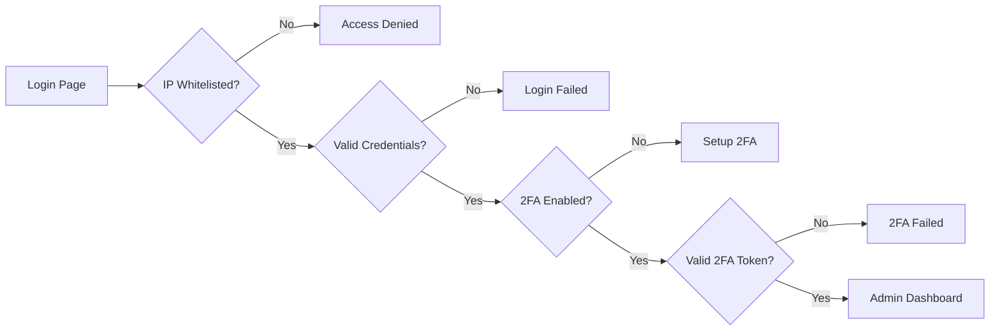

<div align="center">

# CVGenius

### AI-Powered CV Builder Platform with Advanced Admin Dashboard

[](https://opensource.org/licenses/MIT)
[](https://nextjs.org/)
[](https://www.typescriptlang.org/)
[](https://tailwindcss.com/)
[](https://ai.google.dev/)

**[Live Demo](https://cvgenius-one.vercel.app)** • **[Documentation](docs/)** • **[Admin Panel](https://cvgenius-one.vercel.app/admin)**

---

**Privacy-First** | **ATS-Optimized** | **AI-Powered** | **Mobile-First PWA**

*Build professional, ATS-friendly CVs with AI assistance. No registration required, data stays local.*

</div>

---

## 📋 Table of Contents

- [Overview](#-overview)
- [Key Features](#-key-features)
- [Quick Start](#-quick-start)
- [Technology Stack](#-technology-stack)
- [Project Structure](#-project-structure)
- [Security](#-security)
- [Deployment](#-deployment)
- [Documentation](#-documentation)
- [Contributing](#-contributing)
- [License](#-license)

---

## 🎯 Overview

CVGenius is a production-ready, enterprise-grade CV builder platform that combines cutting-edge AI technology with robust security features. Designed for privacy-conscious users and administrators who demand full control.

### Why CVGenius?

- **🔒 Privacy-First Architecture** - No user accounts, no tracking, all data stored locally
- **🤖 AI-Powered Optimization** - Smart suggestions using Google Gemini 2.0 Flash
- **📊 ATS-Friendly Templates** - 6+ professional templates optimized for Applicant Tracking Systems
- **🛡️ Enterprise Security** - Multi-layer admin panel with JWT, 2FA, IP whitelisting, and audit logging
- **📱 Progressive Web App** - Full offline support with mobile-first design
- **🌍 Global Ready** - Multi-language support, tailored for international job markets

---

## ✨ Key Features

<table>
<tr>
<td width="50%">

### 👤 User Features

- **Smart CV Builder**
  - 6+ professional, ATS-optimized templates
  - Real-time preview with live editing
  - Drag-and-drop section reordering
  - Mobile CV upload & analysis

- **AI-Powered Tools**
  - Intelligent content suggestions
  - Personalized cover letter generation
  - ATS score analysis & optimization
  - Industry-specific recommendations

- **Export Options**
  - PDF (high-quality, ATS-friendly)
  - DOCX (editable format)
  - Plain text export

</td>
<td width="50%">

### 🔐 Admin Features

- **Security & Authentication**
  - JWT token-based authentication
  - Two-Factor Authentication (TOTP)
  - IP whitelisting with CIDR support
  - CSRF protection & rate limiting

- **Management Dashboard**
  - AI model configuration
  - Dynamic prompt management
  - Ad monetization controls
  - Security audit logs (AES-256 encrypted)

- **Integrations**
  - Vercel environment sync
  - Real-time analytics
  - Automated backup system

</td>
</tr>
</table>

---

## 🚀 Quick Start

### Prerequisites

- **Node.js** 18.x or higher (20.x recommended)
- **npm** 9.x or higher
- **Google Gemini API Key** ([Get free key](https://ai.google.dev/))

### Installation

```bash
# 1. Clone the repository
git clone https://github.com/your-username/cv-genius-project-v2.git
cd cv-genius-project-v2

# 2. Install dependencies
npm install

# 3. Set up environment variables
cp .env.example .env.local
```

### Environment Configuration

Edit `.env.local` with your configuration:

```env
# AI Configuration (Required)
GOOGLE_AI_API_KEY=your_gemini_api_key_here

# Admin Security (Required for admin panel)
ADMIN_USERNAME=admin
ADMIN_PWD_HASH_B64=your_bcrypt_hash_base64
JWT_SECRET=your_256_bit_secret_key
ADMIN_IP_WHITELIST=127.0.0.1,::1

# Security Audit (Required for admin)
AUDIT_ENCRYPTION_KEY=your_32_character_key
```

### Generate Secure Credentials

```bash
# Generate password hash
node -e "
const bcrypt = require('bcryptjs');
const password = 'your-secure-password';
const hash = bcrypt.hashSync(password, 10);
console.log('ADMIN_PWD_HASH_B64=' + Buffer.from(hash).toString('base64'));
"

# Generate JWT secret (256-bit)
node -e "console.log('JWT_SECRET=' + require('crypto').randomBytes(32).toString('hex'))"

# Generate encryption key (32 characters)
node -e "console.log('AUDIT_ENCRYPTION_KEY=' + require('crypto').randomBytes(16).toString('hex'))"
```

### Start Development Server

```bash
npm run dev
```

Visit:
- **Application**: http://localhost:3000
- **Admin Panel**: http://localhost:3000/admin

---

## 🛠 Technology Stack

### Core Framework
- **[Next.js 15.3.4](https://nextjs.org/)** - React framework with App Router
- **[TypeScript 5.0](https://www.typescriptlang.org/)** - Type-safe development
- **[Tailwind CSS](https://tailwindcss.com/)** - Utility-first CSS framework
- **[shadcn/ui](https://ui.shadcn.com/)** - High-quality React components

### AI & Processing
- **[Google Gemini 2.0 Flash](https://ai.google.dev/)** - AI content generation
- **[@react-pdf/renderer](https://react-pdf.org/)** - PDF generation
- **[docx](https://www.npmjs.com/package/docx)** - DOCX export

### State & Forms
- **[Zustand](https://zustand-demo.pmnd.rs/)** - Lightweight state management
- **[React Hook Form](https://react-hook-form.com/)** - Performant form handling
- **[Zod](https://zod.dev/)** - Schema validation

### Security
- **[jose](https://github.com/panva/jose)** - JWT token management
- **[bcryptjs](https://www.npmjs.com/package/bcryptjs)** - Password hashing
- **[speakeasy](https://www.npmjs.com/package/speakeasy)** - TOTP 2FA
- **[crypto](https://nodejs.org/api/crypto.html)** - AES-256 encryption

---

## 📂 Project Structure

```
cv-genius-project-v2/
│
├── 📱 src/app/                    # Next.js App Router
│   ├── admin/                     # Admin panel & dashboard
│   │   ├── components/            # Admin UI components
│   │   └── page.tsx               # Admin dashboard
│   ├── api/                       # API routes
│   │   ├── admin/                 # Protected admin APIs
│   │   │   ├── auth/              # Authentication endpoints
│   │   │   ├── 2fa/               # Two-factor authentication
│   │   │   ├── audit/             # Security audit logs
│   │   │   ├── settings/          # Configuration management
│   │   │   └── vercel/            # Vercel integration
│   │   └── ai/                    # AI-powered endpoints
│   ├── builder/                   # CV builder application
│   ├── cover-letter/              # Cover letter generator
│   └── layout.tsx                 # Root layout
│
├── 🧩 src/components/             # Reusable components
│   ├── ads/                       # Ad management components
│   ├── cv/                        # CV-related components
│   ├── templates/                 # CV templates
│   └── ui/                        # shadcn/ui components
│
├── 🔧 src/lib/                    # Utilities & configurations
│   ├── ai/                        # AI service integration
│   ├── auth/                      # Authentication utilities
│   ├── security/                  # Security middleware
│   └── utils/                     # Helper functions
│
├── 🗄️ src/store/                  # Zustand state stores
│   ├── cv-store.ts                # CV builder state
│   └── admin-store.ts             # Admin panel state
│
├── 📋 src/types/                  # TypeScript definitions
│
├── 📚 docs/                       # Documentation
│   ├── setup/                     # Setup guides
│   ├── deployment/                # Deployment guides
│   ├── security/                  # Security documentation
│   └── features/                  # Feature documentation
│
├── 🔧 scripts/                    # Utility scripts
│   ├── hash-generator.js          # Password hash generator
│   ├── reset-2fa.js               # 2FA reset utility
│   └── debug-hooks.js             # Debug utilities
│
├── 📊 data/                       # Runtime data (gitignored)
│   ├── admin-settings.json        # Admin configuration
│   ├── admin-ip-whitelist.json    # IP whitelist
│   └── .2fa-state.json            # 2FA state
│
└── 🌐 public/                     # Static assets
    ├── icons/                     # PWA icons
    └── manifest.json              # PWA manifest
```

---

## 🔒 Security

CVGenius implements enterprise-grade security features:

### Admin Panel Security

| Feature | Implementation | Purpose |
|---------|---------------|---------|
| **JWT Authentication** | 2-hour tokens with refresh | Secure session management |
| **Two-Factor Auth** | TOTP (Google Authenticator) | Additional login protection |
| **IP Whitelisting** | CIDR support, environment-based | Access control |
| **CSRF Protection** | Token-based validation | Prevent cross-site attacks |
| **Rate Limiting** | In-memory (upgradeable to Redis) | Prevent brute force |
| **Audit Logging** | AES-256-CBC encrypted | Security event tracking |
| **Session Recovery** | Auto-restoration on CSRF errors | User experience |

### Security Best Practices

```bash
# Production checklist
✅ Change default admin credentials
✅ Configure production IP whitelist
✅ Use strong JWT secret (256-bit minimum)
✅ Enable 2FA for all admin accounts
✅ Set up monitoring and alerts
✅ Configure audit log backup
✅ Test security features in staging
```

### Admin Access Flow



> 📖 **Detailed Security Documentation**: [docs/SECURITY.md](docs/SECURITY.md)

---

## 🌐 Deployment

### Vercel (Recommended)

```bash
# 1. Install Vercel CLI
npm i -g vercel

# 2. Deploy to Vercel
vercel

# 3. Configure environment variables
# Add all variables from .env.example in Vercel dashboard

# 4. Deploy to production
vercel --prod
```

### Production Environment Variables

All environment variables from `.env.example` must be configured in Vercel dashboard:

1. Navigate to **Settings** → **Environment Variables**
2. Add each variable from `.env.example`
3. Update `ADMIN_IP_WHITELIST` with production IPs
4. Save and redeploy

### Production Deployment Checklist

- [ ] All environment variables configured
- [ ] Admin credentials changed from defaults
- [ ] IP whitelist updated for production
- [ ] 2FA enabled and tested
- [ ] Custom domain configured (optional)
- [ ] Analytics and monitoring enabled
- [ ] Backup strategy implemented
- [ ] Security features tested

> 📖 **Deployment Guide**: [docs/deployment/VERCEL_DEPLOYMENT_GUIDE.md](docs/deployment/VERCEL_DEPLOYMENT_GUIDE.md)

---

## 📚 Documentation

Comprehensive documentation is available in the `/docs` directory:

### 📖 Guides

| Category | Documents |
|----------|-----------|
| **Setup** | [Gemini AI Setup](docs/setup/GEMINI_SETUP.md) • [2FA Configuration](docs/setup/VERCEL_2FA_SETUP.md) |
| **Deployment** | [Vercel Deployment](docs/deployment/VERCEL_DEPLOYMENT_GUIDE.md) • [Production Setup](docs/PRODUCTION_DEPLOYMENT.md) |
| **Security** | [Security Policy](docs/SECURITY.md) • [Security Audit](docs/SECURITY_AUDIT_TODO.md) |
| **Development** | [Contributing Guide](docs/CONTRIBUTING.md) • [Workflow](docs/DEVELOPMENT_WORKFLOW.md) |
| **Features** | [Cover Letter Templates](docs/features/COVER_LETTER_TEMPLATES.md) • [Mobile PDF Export](docs/technical/mobile-pdf-export-solutions.md) |

### 🔧 Utility Scripts

All utility scripts are documented in [scripts/README.md](scripts/README.md):

- Password hash generation
- 2FA reset and recovery
- Development environment reset
- Production deployment automation

---

## 👥 Contributing

We welcome contributions! Please follow these guidelines:

### Development Workflow

1. **Fork** the repository
2. **Create** a feature branch: `git checkout -b feature/amazing-feature`
3. **Commit** your changes: `git commit -m 'Add amazing feature'`
4. **Push** to your fork: `git push origin feature/amazing-feature`
5. **Open** a Pull Request

### Code Standards

- Follow existing code style and conventions
- Write meaningful commit messages
- Add tests for new features
- Update documentation as needed
- Test admin security features thoroughly

### Testing

```bash
# Run development server
npm run dev

# Build for production
npm run build

# Start production server
npm start

# Run Cypress E2E tests
npm run cypress:open
```

> 📖 **Contributing Guide**: [docs/CONTRIBUTING.md](docs/CONTRIBUTING.md)

---

## ⚠️ Important Notes

### Security Warnings

- 🚨 **NEVER** commit `.env.local` or authentication files
- 🔐 Use **strong, unique** passwords and secrets
- 🔄 **Rotate** admin credentials regularly
- 📍 **Restrict** admin access to known IPs only
- 👁️ **Monitor** audit logs for suspicious activity
- 🔒 Keep **dependencies updated** for security patches

### Data Privacy

- ✅ **No user accounts** - completely privacy-focused
- ✅ **Local storage only** - data never leaves the browser
- ✅ **No tracking** - no analytics on user CVs
- ✅ **GDPR compliant** - by design

---

## 📄 License

This project is licensed under the **MIT License** - see the [LICENSE](LICENSE) file for details.

---

## 🆘 Support

### Get Help

- 🐛 **Bug Reports**: [Create an issue](https://github.com/your-username/cv-genius-project-v2/issues)
- 💡 **Feature Requests**: [Request a feature](https://github.com/your-username/cv-genius-project-v2/issues)
- 🔒 **Security Issues**: Please report privately to security@yourproject.com
- 📖 **Documentation**: Check [/docs](docs/) directory

### Useful Links

- 🏠 [Live Demo](https://cvgenius-one.vercel.app)
- 👨‍💼 [Admin Panel](https://cvgenius-one.vercel.app/admin)
- 📚 [Full Documentation](docs/README.md)
- 🔐 [Security Policy](docs/SECURITY.md)

---

<div align="center">

**Built with ❤️ using Next.js, TypeScript, and Google Gemini AI**

⭐ Star this repo if you find it helpful!

</div>
